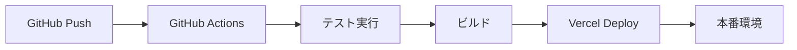

# 上毛かるたタイピングゲーム アーキテクチャ設計

## システム概要

上毛かるたの読み札を使用した教育的タイピングゲームアプリケーション。段階的な開発アプローチを採用し、Phase 1-2ではクライアントサイドのみで動作するスタンドアロンアプリケーションとして実装し、Phase 3-4でSupabaseバックエンドを統合してマルチユーザー機能を実現する。

## アーキテクチャパターン

### Phase 1-2: クライアントサイドアーキテクチャ

- **パターン**: SPA (Single Page Application) + Progressive Enhancement
- **理由**:
  - オフライン動作を保証し、ネットワーク環境に依存しない学習体験を提供
  - 初期開発の迅速化とデプロイの簡素化
  - ローカルストレージを活用した高速なデータアクセス

### Phase 3-4: フルスタックアーキテクチャ

- **パターン**: BaaS (Backend as a Service) + Jamstack
- **理由**:
  - Supabaseによるサーバーレスアーキテクチャで運用コストを最小化
  - リアルタイム機能の簡単な実装
  - 認証・認可の標準化された実装

## コンポーネント構成

### フロントエンド

#### 技術スタック

- **フレームワーク**: SvelteKit 2 + Svelte 5
- **状態管理**:
  - ローカル: Svelte Store
  - グローバル: Context API
  - 永続化: LocalStorage / IndexedDB (Phase 1-2), Supabase (Phase 3-4)
- **スタイリング**: Tailwind CSS 4.0
- **型安全性**: TypeScript (strict mode)

#### レイヤー構成

```
src/
├── routes/          # SvelteKitルーティング
│   ├── +layout.svelte
│   ├── +page.svelte
│   ├── game/        # ゲーム画面
│   ├── practice/    # 練習モード
│   ├── stats/       # 統計・成績
│   └── settings/    # 設定画面
├── lib/
│   ├── components/  # UIコンポーネント
│   │   ├── game/    # ゲーム関連コンポーネント
│   │   ├── ui/      # 汎用UIコンポーネント
│   │   └── layout/  # レイアウトコンポーネント
│   ├── stores/      # 状態管理
│   │   ├── game.ts  # ゲーム状態
│   │   ├── user.ts  # ユーザー情報
│   │   └── settings.ts # 設定情報
│   ├── services/    # ビジネスロジック
│   │   ├── typing/  # タイピング判定
│   │   ├── karuta/  # かるたデータ管理
│   │   └── storage/ # データ永続化
│   ├── utils/       # ユーティリティ関数
│   └── types/       # 型定義
```

### バックエンド (Phase 3-4)

#### Supabase構成

- **認証**: Supabase Auth
  - ソーシャルログイン (Google, Twitter)
  - メール/パスワード認証
  - マジックリンク
- **データベース**: PostgreSQL
  - Row Level Security (RLS) によるデータ保護
  - リアルタイムサブスクリプション
- **ストレージ**: Supabase Storage
  - ユーザーアバター
  - カスタムテーマファイル
  - エクスポートデータ
- **エッジファンクション**: Deno Deploy
  - スコア集計
  - ランキング計算
  - 対戦マッチング

### データベース

#### Phase 1-2: ローカルストレージ

- **LocalStorage**: 設定情報、簡単な進捗データ
- **IndexedDB**: 詳細な学習記録、統計データ

#### Phase 3-4: PostgreSQL (Supabase)

- **テーブル構成**:
  - users: ユーザー情報
  - game_sessions: ゲームセッション
  - scores: スコア記録
  - progress: 学習進捗
  - rankings: ランキング情報
  - matches: 対戦情報

## セキュリティ設計

### フロントエンド

- CSP (Content Security Policy) の適用
- XSS対策: サニタイゼーション処理
- CSRF対策: トークンベース認証

### バックエンド (Phase 3-4)

- Row Level Security (RLS) によるデータアクセス制御
- JWT トークンによる認証
- Rate Limiting によるAPI保護
- 環境変数による機密情報管理

## パフォーマンス最適化

### フロントエンド

- コード分割とLazy Loading
- 画像の最適化とWebP対応
- Service Workerによるキャッシュ戦略
- Virtual DOMの効率的な更新 (Svelte)

### データ通信 (Phase 3-4)

- GraphQL的なデータフェッチング (Supabase Realtime)
- オプティミスティックUI更新
- デバウンス/スロットリング処理
- WebSocketによるリアルタイム通信

## スケーラビリティ

### 水平スケーリング

- Vercelのエッジネットワーク活用
- Supabaseの自動スケーリング
- CDNによる静的アセット配信

### 垂直スケーリング

- データベースのインデックス最適化
- クエリの最適化
- キャッシュ戦略の改善

## 監視とロギング

### エラー監視

- クライアントサイドエラーのキャッチと報告
- Vercel Analytics統合

### パフォーマンス監視

- Core Web Vitals測定
- ユーザー行動分析
- リソース使用状況の追跡

## デプロイメント

### CI/CD パイプライン



### 環境構成

- **開発環境**: ローカル開発サーバー
- **ステージング環境**: Vercel Preview
- **本番環境**: Vercel Production

## 移行戦略 (Phase 2 → Phase 3)

1. **データ移行**
   - LocalStorage/IndexedDBからSupabaseへのデータ移行ツール
   - 既存ユーザーのシームレスな移行

2. **機能の段階的有効化**
   - Feature Flagによる機能制御
   - A/Bテストの実施

3. **後方互換性の維持**
   - オフラインモードの継続サポート
   - 既存のローカルデータとの同期
