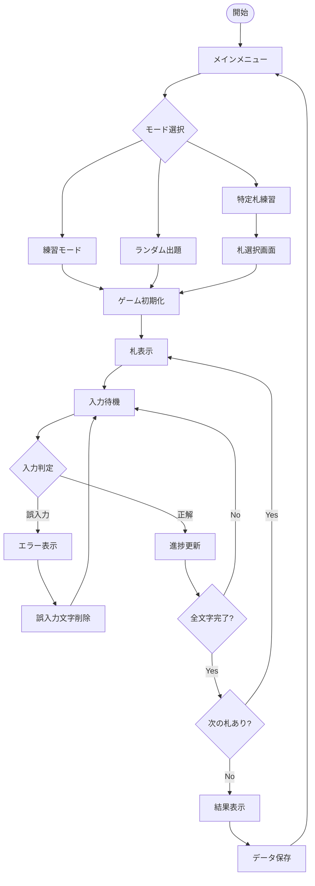
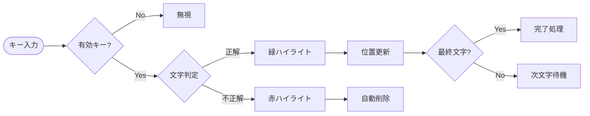
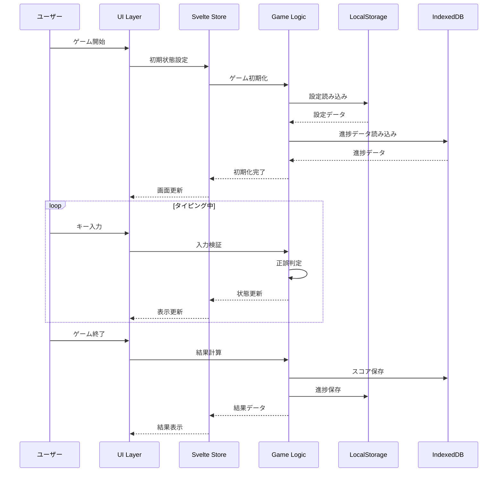
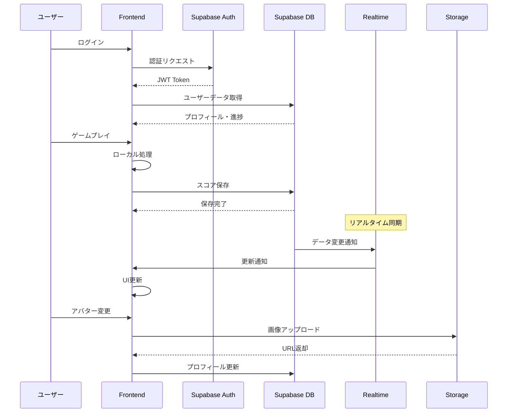
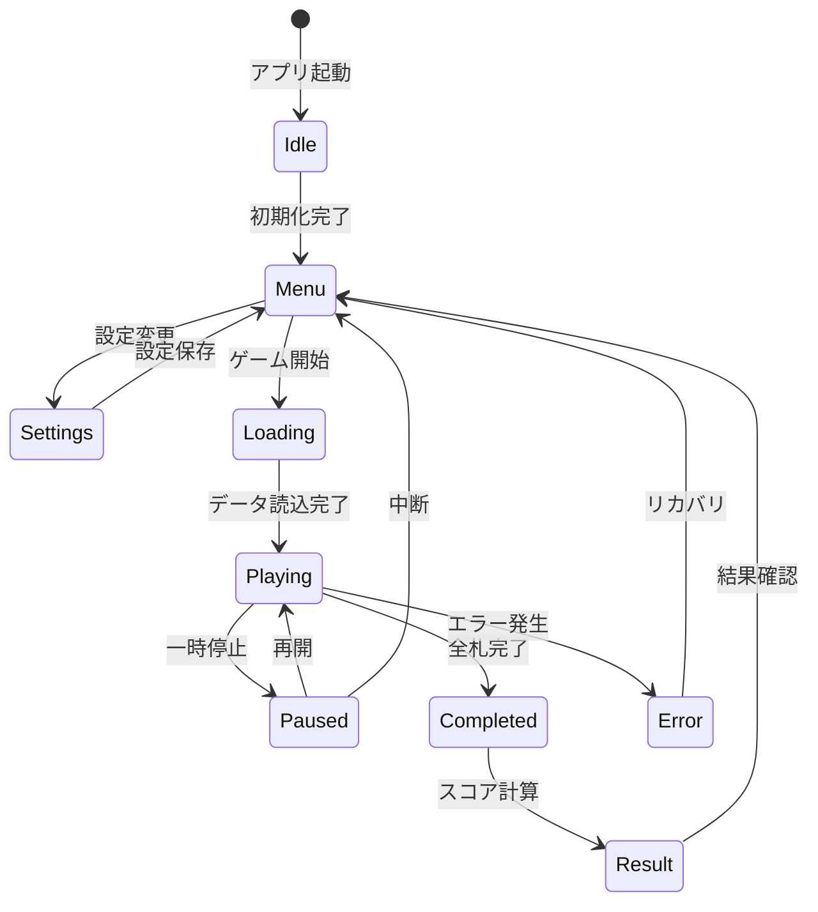
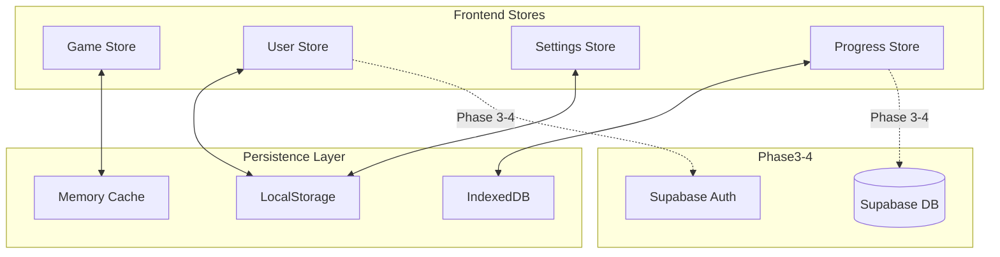
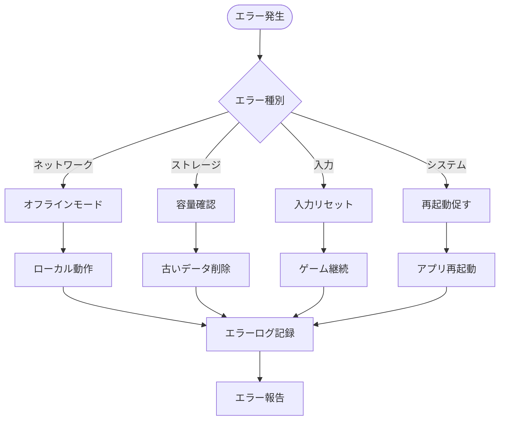
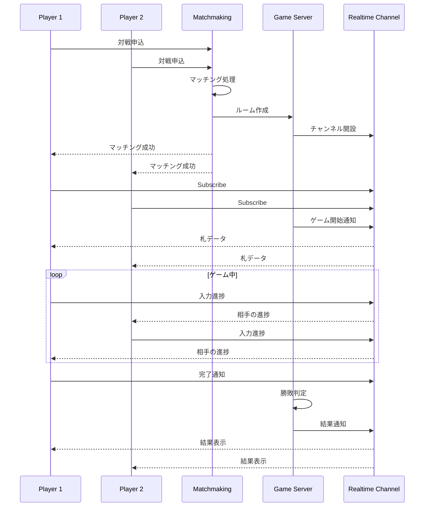

# データフロー図

## ゲームプレイフロー

### 基本的なゲームフロー

### 入力判定の詳細フロー

## データ処理フロー

### ユーザー操作とデータの流れ (Phase 1-2)

### データ同期フロー (Phase 3-4)

## 状態管理フロー

### ゲーム状態の遷移

### データストアの相互作用

## エラーハンドリングフロー

## リアルタイム対戦フロー (Phase 4)

