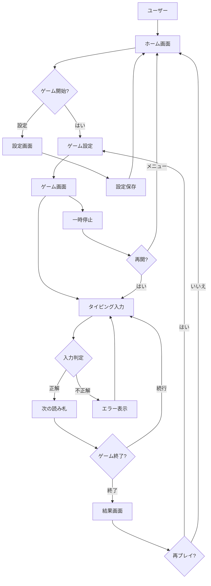
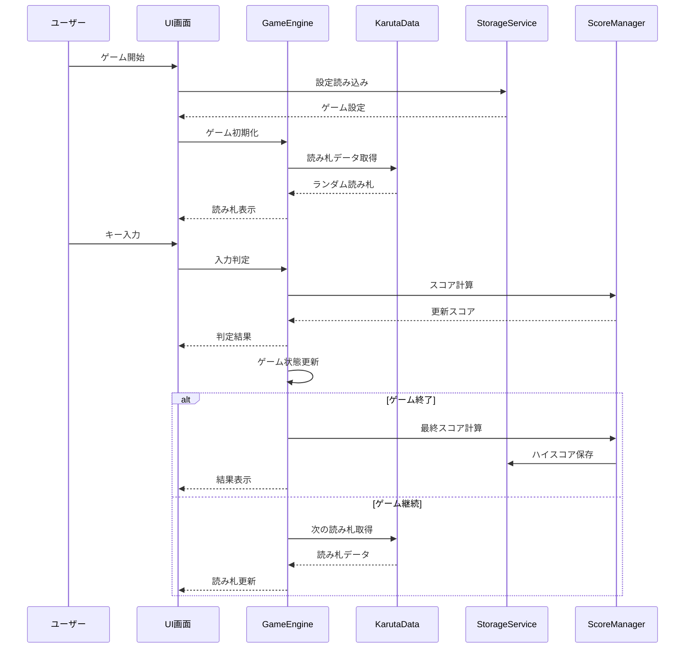
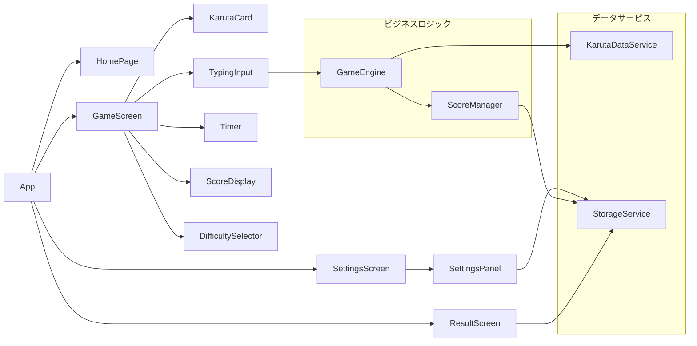
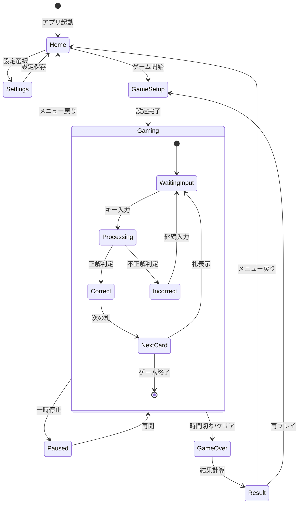
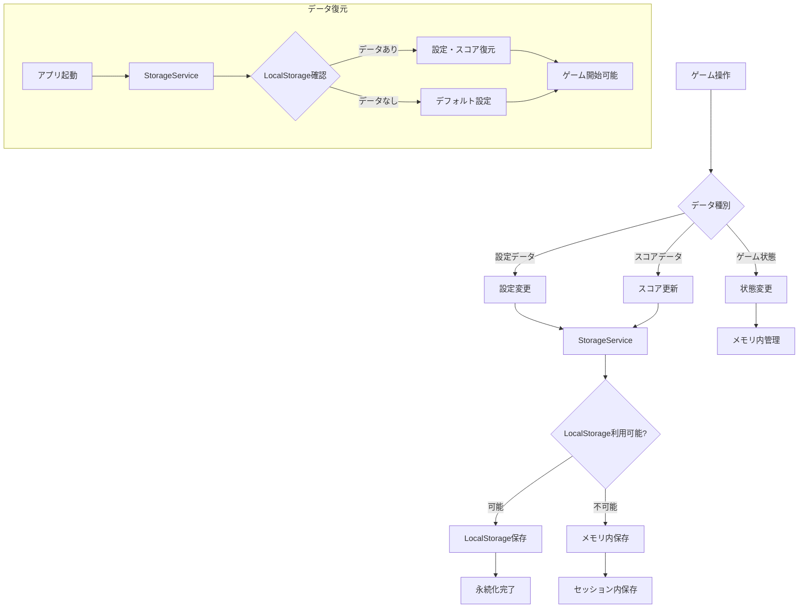
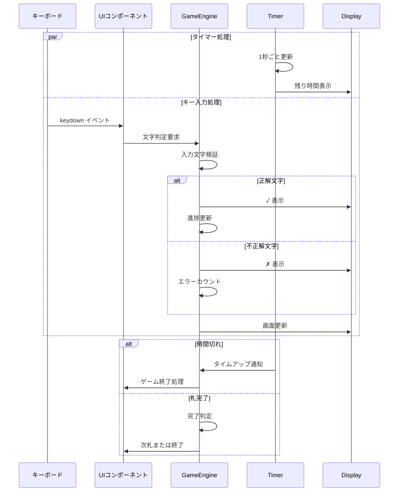

# データフロー図

## ユーザーインタラクションフロー

```mermaid
flowchart TD
    A[ユーザー] --> B[ホーム画面]
    B --> C{ゲーム開始?}
    C -->|はい| D[ゲーム設定]
    C -->|設定| E[設定画面]
    
    D --> F[ゲーム画面]
    F --> G[タイピング入力]
    G --> H{入力判定}
    
    H -->|正解| I[次の読み札]
    H -->|不正解| J[エラー表示]
    J --> G
    
    I --> K{ゲーム終了?}
    K -->|続行| G
    K -->|終了| L[結果画面]
    
    L --> M{再プレイ?}
    M -->|はい| D
    M -->|いいえ| B
    
    E --> N[設定保存]
    N --> B
    
    F --> O[一時停止]
    O --> P{再開?}
    P -->|はい| G
    P -->|メニュー| B
```

## ゲームデータフロー

```mermaid
sequenceDiagram
    participant U as ユーザー
    participant UI as UI画面
    participant GE as GameEngine
    participant KD as KarutaData
    participant ST as StorageService
    participant SC as ScoreManager
    
    U->>UI: ゲーム開始
    UI->>ST: 設定読み込み
    ST-->>UI: ゲーム設定
    
    UI->>GE: ゲーム初期化
    GE->>KD: 読み札データ取得
    KD-->>GE: ランダム読み札
    GE-->>UI: 読み札表示
    
    U->>UI: キー入力
    UI->>GE: 入力判定
    GE->>SC: スコア計算
    SC-->>GE: 更新スコア
    GE-->>UI: 判定結果
    
    GE->>GE: ゲーム状態更新
    
    alt ゲーム終了
        GE->>SC: 最終スコア計算
        SC->>ST: ハイスコア保存
        GE-->>UI: 結果表示
    else ゲーム継続
        GE->>KD: 次の読み札取得
        KD-->>GE: 読み札データ
        GE-->>UI: 読み札更新
    end
```

## コンポーネント間データフロー

```mermaid
flowchart LR
    A[App] --> B[HomePage]
    A --> C[GameScreen]
    A --> D[SettingsScreen]
    A --> E[ResultScreen]
    
    C --> F[KarutaCard]
    C --> G[TypingInput]
    C --> H[Timer]
    C --> I[ScoreDisplay]
    C --> J[DifficultySelector]
    
    G --> K[GameEngine]
    K --> L[ScoreManager]
    K --> M[KarutaDataService]
    
    D --> N[SettingsPanel]
    N --> O[StorageService]
    
    L --> O
    E --> O
    
    subgraph "データサービス"
        O[StorageService]
        M[KarutaDataService]
    end
    
    subgraph "ビジネスロジック"
        K[GameEngine]
        L[ScoreManager]
    end
```

## 状態管理フロー

```mermaid
stateDiagram-v2
    [*] --> Home: アプリ起動
    
    Home --> Settings: 設定選択
    Settings --> Home: 設定保存
    
    Home --> GameSetup: ゲーム開始
    GameSetup --> Gaming: 設定完了
    
    Gaming --> Paused: 一時停止
    Paused --> Gaming: 再開
    Paused --> Home: メニュー戻り
    
    Gaming --> GameOver: 時間切れ/クリア
    GameOver --> Result: 結果計算
    
    Result --> Home: メニュー戻り
    Result --> GameSetup: 再プレイ
    
    state Gaming {
        [*] --> WaitingInput
        WaitingInput --> Processing: キー入力
        Processing --> Correct: 正解判定
        Processing --> Incorrect: 不正解判定
        Correct --> NextCard: 次の札
        Incorrect --> WaitingInput: 継続入力
        NextCard --> WaitingInput: 札表示
        NextCard --> [*]: ゲーム終了
    }
```

## データ永続化フロー

```mermaid
flowchart TD
    A[ゲーム操作] --> B{データ種別}
    
    B -->|設定データ| C[設定変更]
    B -->|スコアデータ| D[スコア更新]
    B -->|ゲーム状態| E[状態変更]
    
    C --> F[StorageService]
    D --> F
    E --> G[メモリ内管理]
    
    F --> H{LocalStorage利用可能?}
    H -->|可能| I[LocalStorage保存]
    H -->|不可能| J[メモリ内保存]
    
    I --> K[永続化完了]
    J --> L[セッション内保存]
    
    subgraph "データ復元"
        M[アプリ起動] --> N[StorageService]
        N --> O{LocalStorage確認}
        O -->|データあり| P[設定・スコア復元]
        O -->|データなし| Q[デフォルト設定]
        P --> R[ゲーム開始可能]
        Q --> R
    end
```

## リアルタイム処理フロー

```mermaid
sequenceDiagram
    participant K as キーボード
    participant UI as UIコンポーネント
    participant GE as GameEngine
    participant T as Timer
    participant D as Display
    
    par タイマー処理
        T->>T: 1秒ごと更新
        T->>D: 残り時間表示
    and キー入力処理
        K->>UI: keydown イベント
        UI->>GE: 文字判定要求
        GE->>GE: 入力文字検証
        
        alt 正解文字
            GE->>D: ✓ 表示
            GE->>GE: 進捗更新
        else 不正解文字  
            GE->>D: ✗ 表示
            GE->>GE: エラーカウント
        end
        
        GE->>D: 画面更新
    end
    
    alt 時間切れ
        T->>GE: タイムアップ通知
        GE->>UI: ゲーム終了処理
    else 札完了
        GE->>GE: 完了判定
        GE->>UI: 次札または終了
    end
```