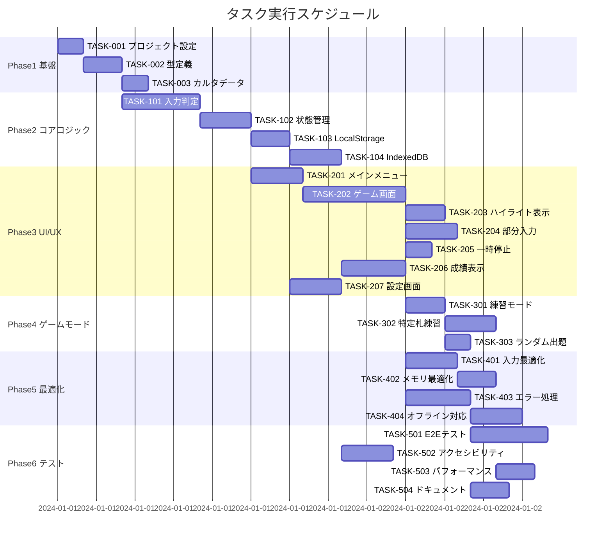

# 上毛カルタタイピングゲーム 実装タスク

## 概要

全タスク数: 28
推定作業時間: 約80時間
クリティカルパス: TASK-001 → TASK-002 → TASK-003 → TASK-101 → TASK-102 → TASK-201

## タスク一覧

### Phase 1: 基盤構築とプロジェクトセットアップ

#### TASK-001: プロジェクト基本設定

- [x] **タスク完了**
- **タスクタイプ**: DIRECT
- **要件リンク**: 技術仕様
- **依存タスク**: なし
- **実装詳細**:
  - TypeScript strictモードの設定確認
  - ESLint/Prettierの設定確認
  - Tailwind CSS 4.0の設定確認
  - Viteビルド設定の最適化
- **テスト要件**:
  - [x] ビルドが成功すること
  - [x] 型チェックが通ること
  - [x] リントが通ること
- **完了条件**:
  - [x] bun --bun run devでサーバーが起動する
  - [x] bun --bun run buildが成功する
  - [x] bun --bun run checkが成功する

#### TASK-002: 型定義とインターフェースの実装

- [x] **タスク完了**
- **タスクタイプ**: DIRECT
- **要件リンク**: interfaces.ts設計
- **依存タスク**: TASK-001
- **実装詳細**:
  - `src/lib/types/`ディレクトリ作成
  - 設計文書のインターフェースを分割して実装
  - 型ガード関数の実装
  - エクスポート用のindex.tsを作成
- **テスト要件**:
  - [x] 型定義が正しくインポートできる
  - [x] 型ガード関数のユニットテスト
- **完了条件**:
  - [x] すべての型定義が実装されている
  - [x] 型チェックが通る

#### TASK-003: カルタデータの準備

- [x] **タスク完了**
- **タスクタイプ**: DIRECT
- **要件リンク**: REQ-001
- **依存タスク**: TASK-002
- **実装詳細**:
  - 上毛カルタ44枚のデータをJSON形式で作成
  - `src/lib/data/karuta-cards.json`に配置
  - データ検証用のスクリプト作成
- **テスト要件**:
  - [x] 44枚すべてのデータが存在する
  - [x] データ形式が型定義に一致する
- **完了条件**:
  - [x] カルタデータが正しく読み込める
  - [x] 型チェックが通る

### Phase 2: コアゲームロジック実装

#### TASK-101: ローマ字入力判定エンジン

- [x] **タスク完了**
- **タスクタイプ**: TDD
- **要件リンク**: REQ-003, REQ-107, REQ-108, REQ-401
- **依存タスク**: TASK-002
- **実装詳細**:
  - `src/lib/services/typing/input-validator.ts`
  - ひらがな→ローマ字変換ロジック
  - 複数パターン対応（し→shi/si、つ→tsu/tu等）
  - 正誤判定とフィードバック
- **テスト要件**:
  - [x] 単体テスト: 全ひらがなパターンの変換
  - [x] 単体テスト: 複数入力パターンの判定
  - [x] 単体テスト: 誤入力の検出
- **エラーハンドリング**:
  - [x] 無効な文字入力
  - [x] IME有効時の処理
- **完了条件**:
  - [x] すべてのひらがなが正しく判定される
  - [x] テストカバレッジ90%以上

#### TASK-102: ゲーム状態管理ストア

- [x] **タスク完了**
- **タスクタイプ**: TDD
- **要件リンク**: REQ-005, REQ-006, REQ-111
- **依存タスク**: TASK-101
- **実装詳細**:
  - `src/lib/stores/game.ts`
  - Svelte Storeでゲーム状態管理
  - セッション管理
  - 進捗トラッキング
- **テスト要件**:
  - [x] 単体テスト: ストアの状態遷移
  - [x] 単体テスト: スコア計算ロジック
  - [x] 統合テスト: ゲームフロー
- **完了条件**:
  - [x] リアクティブな更新が動作する
  - [x] ゲーム状態が正しく管理される

#### TASK-103: ローカルストレージ永続化

- [x] **タスク完了**
- **タスクタイプ**: TDD
- **要件リンク**: REQ-113, REQ-403
- **依存タスク**: TASK-102
- **実装詳細**:
  - `src/lib/services/storage/local-storage.ts`
  - 設定の保存/読み込み
  - ゲーム進捗の保存
  - データ暗号化（簡易）
- **テスト要件**:
  - [x] 単体テスト: データの保存/読み込み
  - [x] 単体テスト: データ整合性チェック
  - [x] エッジケース: ストレージ容量超過
- **完了条件**:
  - [x] データが永続化される
  - [x] ブラウザリロード後も復元される

#### TASK-104: IndexedDB実装

- [x] **タスク完了**
- **タスクタイプ**: TDD
- **要件リンク**: REQ-005, REQ-006
- **依存タスク**: TASK-103
- **実装詳細**:
  - `src/lib/services/storage/indexed-db.ts`
  - Dexie.jsを使用したIndexedDB実装
  - 詳細な成績データの保存
  - バージョン管理とマイグレーション
- **テスト要件**:
  - [x] 単体テスト: CRUD操作
  - [x] 統合テスト: データマイグレーション
- **完了条件**:
  - [x] 大容量データが保存できる
  - [x] クエリが高速に実行される

### Phase 3: UI/UXコンポーネント実装

#### TASK-201: メインメニュー画面

- [ ] **タスク完了**
- **タスクタイプ**: TDD
- **要件リンク**: REQ-007, REQ-101, REQ-102, REQ-103
- **依存タスク**: TASK-102
- **実装詳細**:
  - `src/routes/+page.svelte`
  - モード選択UI
  - 設定へのナビゲーション
  - 統計表示へのリンク
- **UI/UX要件**:
  - [ ] ローディング状態: 初期データ読み込み中の表示
  - [ ] エラー表示: データ読み込み失敗時
  - [ ] モバイル対応: タッチ操作最適化
  - [ ] アクセシビリティ: キーボードナビゲーション
- **テスト要件**:
  - [ ] コンポーネントテスト
  - [ ] レスポンシブテスト
- **完了条件**:
  - [ ] 全モードが選択できる
  - [ ] ナビゲーションが機能する

#### TASK-202: タイピングゲーム画面

- [ ] **タスク完了**
- **タスクタイプ**: TDD
- **要件リンク**: REQ-002, REQ-003, REQ-004, REQ-107, REQ-108
- **依存タスク**: TASK-201, TASK-101
- **実装詳細**:
  - `src/routes/game/+page.svelte`
  - 札表示コンポーネント
  - 入力フィールド（非表示）
  - リアルタイムフィードバック表示
  - プログレスバー
- **UI/UX要件**:
  - [ ] ローディング状態: 札読み込み中
  - [ ] エラー表示: 入力エラーの視覚的フィードバック
  - [ ] アニメーション: 文字ハイライト、遷移効果
  - [ ] レスポンシブ: 画面サイズに応じたレイアウト
  - [ ] アクセシビリティ: スクリーンリーダー対応
- **テスト要件**:
  - [ ] 単体テスト: 入力判定の表示
  - [ ] E2Eテスト: ゲームフロー全体
  - [ ] パフォーマンステスト: 30ms以内の応答
- **完了条件**:
  - [ ] タイピングが正しく動作する
  - [ ] ビジュアルフィードバックが適切

#### TASK-203: 入力ハイライト表示

- [ ] **タスク完了**
- **タスクタイプ**: TDD
- **要件リンク**: REQ-004, REQ-107, REQ-108
- **依存タスク**: TASK-202
- **実装詳細**:
  - `src/lib/components/game/InputHighlight.svelte`
  - 文字ごとのハイライト表示
  - 正解：緑、誤答：赤の色分け
  - カーソル位置の表示
- **UI/UX要件**:
  - [ ] アニメーション: スムーズな色遷移
  - [ ] パフォーマンス: 高速な再レンダリング
  - [ ] アクセシビリティ: 色覚異常対応
- **テスト要件**:
  - [ ] 視覚的回帰テスト
  - [ ] パフォーマンステスト
- **完了条件**:
  - [ ] ハイライトが正しく表示される
  - [ ] パフォーマンスが基準を満たす

#### TASK-204: 部分入力モード実装

- [ ] **タスク完了**
- **タスクタイプ**: TDD
- **要件リンク**: REQ-008, REQ-104, REQ-105, REQ-106
- **依存タスク**: TASK-202
- **実装詳細**:
  - 部分入力判定ロジック
  - 文字数設定UI
  - 初心者モードの自動設定
- **UI/UX要件**:
  - [ ] 設定UI: スライダーまたは数値入力
  - [ ] 視覚的表示: 入力対象範囲の明示
- **テスト要件**:
  - [ ] 単体テスト: 部分入力判定
  - [ ] 統合テスト: モード切り替え
- **完了条件**:
  - [ ] 部分入力が正しく動作する
  - [ ] 初心者モードが機能する

#### TASK-205: 一時停止機能

- [ ] **タスク完了**
- **タスクタイプ**: TDD
- **要件リンク**: REQ-112, REQ-203
- **依存タスク**: TASK-202
- **実装詳細**:
  - 一時停止ボタンUI
  - 状態保存と復元
  - タイマー管理
- **UI/UX要件**:
  - [ ] オーバーレイ表示
  - [ ] 再開ボタン
  - [ ] ESCキーでの操作
- **テスト要件**:
  - [ ] 機能テスト: 一時停止/再開
  - [ ] 状態テスト: データ保持
- **完了条件**:
  - [ ] 一時停止が正しく動作する
  - [ ] 状態が保持される

#### TASK-206: 成績表示画面

- [ ] **タスク完了**
- **タスクタイプ**: TDD
- **要件リンク**: REQ-005, REQ-114, REQ-204
- **依存タスク**: TASK-102, TASK-104
- **実装詳細**:
  - `src/routes/stats/+page.svelte`
  - 成績サマリー表示
  - 詳細統計グラフ
  - 札ごとの進捗表示
- **UI/UX要件**:
  - [ ] データビジュアライゼーション
  - [ ] フィルタリング機能
  - [ ] エクスポート機能（CSV）
- **テスト要件**:
  - [ ] データ表示の正確性
  - [ ] グラフレンダリング
- **完了条件**:
  - [ ] 統計が正しく表示される
  - [ ] インタラクティブな操作が可能

#### TASK-207: 設定画面

- [ ] **タスク完了**
- **タスクタイプ**: TDD
- **要件リンク**: GameSettings型定義
- **依存タスク**: TASK-103
- **実装詳細**:
  - `src/routes/settings/+page.svelte`
  - 各種設定項目のUI
  - 設定の保存と読み込み
  - デフォルト値へのリセット
- **UI/UX要件**:
  - [ ] フォームバリデーション
  - [ ] 即座の反映プレビュー
  - [ ] 保存確認ダイアログ
- **テスト要件**:
  - [ ] 設定の保存/読み込み
  - [ ] バリデーション動作
- **完了条件**:
  - [ ] すべての設定が変更できる
  - [ ] 設定が永続化される

### Phase 4: ゲームモード実装

#### TASK-301: 練習モード

- [ ] **タスク完了**
- **タスクタイプ**: TDD
- **要件リンク**: REQ-007, REQ-101
- **依存タスク**: TASK-202
- **実装詳細**:
  - 全札順番出題ロジック
  - 時間制限なし
  - 途中再開機能
- **テスト要件**:
  - [ ] 出題順序の確認
  - [ ] 中断/再開テスト
- **完了条件**:
  - [ ] 44枚が順番に出題される
  - [ ] 途中再開が可能

#### TASK-302: 特定札練習モード

- [ ] **タスク完了**
- **タスクタイプ**: TDD
- **要件リンク**: REQ-102
- **依存タスク**: TASK-301
- **実装詳細**:
  - 札選択UI
  - 選択札のみの出題ロジック
  - 繰り返し練習機能
- **UI/UX要件**:
  - [ ] 札選択インターフェース
  - [ ] 複数選択/全選択機能
  - [ ] お気に入り機能
- **テスト要件**:
  - [ ] 選択札のみ出題される
  - [ ] 繰り返し動作
- **完了条件**:
  - [ ] 選択した札のみ練習できる
  - [ ] UIが使いやすい

#### TASK-303: ランダム出題モード

- [ ] **タスク完了**
- **タスクタイプ**: TDD
- **要件リンク**: REQ-103
- **依存タスク**: TASK-301
- **実装詳細**:
  - ランダム出題アルゴリズム
  - 重複なし保証
  - シード値による再現性（オプション）
- **テスト要件**:
  - [ ] ランダム性の検証
  - [ ] 全札が出題される
- **完了条件**:
  - [ ] ランダムに出題される
  - [ ] 偏りがない

### Phase 5: パフォーマンス最適化とエラーハンドリング

#### TASK-401: キー入力最適化

- [ ] **タスク完了**
- **タスクタイプ**: TDD
- **要件リンク**: NFR-001, NFR-002
- **依存タスク**: TASK-202
- **実装詳細**:
  - デバウンス処理の最適化
  - 仮想DOMの更新最小化
  - RequestAnimationFrameの活用
- **テスト要件**:
  - [ ] レスポンステスト: 30ms以内
  - [ ] 負荷テスト: 1000回連続入力
- **完了条件**:
  - [ ] 入力遅延30ms以内
  - [ ] CPU使用率の最適化

#### TASK-402: メモリ管理最適化

- [ ] **タスク完了**
- **タスクタイプ**: TDD
- **要件リンク**: NFR-004, NFR-005
- **依存タスク**: TASK-401
- **実装詳細**:
  - メモリリークの検出と修正
  - 不要なリスナーの削除
  - 大規模データの遅延読み込み
- **テスト要件**:
  - [ ] メモリプロファイリング
  - [ ] 長時間動作テスト
- **完了条件**:
  - [ ] メモリ使用量500MB以下
  - [ ] リークがない

#### TASK-403: エラーハンドリング実装

- [ ] **タスク完了**
- **タスクタイプ**: TDD
- **要件リンク**: EDGE-001〜EDGE-305
- **依存タスク**: TASK-202
- **実装詳細**:
  - グローバルエラーハンドラー
  - エラー境界コンポーネント
  - フォールバック処理
  - エラーログ収集
- **UI/UX要件**:
  - [ ] ユーザーフレンドリーなエラー表示
  - [ ] リカバリーオプション提供
  - [ ] エラー詳細の折りたたみ表示
- **テスト要件**:
  - [ ] 各種エラーケースの網羅
  - [ ] リカバリー動作の確認
- **完了条件**:
  - [ ] すべてのエラーが適切に処理される
  - [ ] ユーザー体験が損なわれない

#### TASK-404: オフライン対応

- [ ] **タスク完了**
- **タスクタイプ**: TDD
- **要件リンク**: EDGE-001
- **依存タスク**: TASK-403
- **実装詳細**:
  - Service Worker実装
  - オフライン検出
  - キャッシュ戦略
  - 同期処理
- **テスト要件**:
  - [ ] オフライン動作確認
  - [ ] キャッシュ動作
- **完了条件**:
  - [ ] オフラインで動作する
  - [ ] データが同期される

### Phase 6: テストとドキュメント

#### TASK-501: E2Eテストスイート

- [ ] **タスク完了**
- **タスクタイプ**: TDD
- **要件リンク**: 全機能要件
- **依存タスク**: TASK-303
- **実装詳細**:
  - Playwright設定
  - 主要ユーザーフローのE2Eテスト
  - ビジュアルリグレッションテスト
  - CI/CD統合
- **テスト要件**:
  - [ ] 全ゲームモードのフロー
  - [ ] エラーケース
  - [ ] クロスブラウザテスト
- **完了条件**:
  - [ ] 主要フローがカバーされる
  - [ ] CIで自動実行される

#### TASK-502: アクセシビリティ対応

- [ ] **タスク完了**
- **タスクタイプ**: TDD
- **要件リンク**: NFR-301〜NFR-305
- **依存タスク**: TASK-207
- **実装詳細**:
  - ARIA属性の追加
  - キーボードナビゲーション
  - スクリーンリーダー対応
  - カラーコントラスト調整
- **テスト要件**:
  - [ ] axe-coreによる自動テスト
  - [ ] 手動アクセシビリティテスト
  - [ ] WCAG 2.1 AA準拠チェック
- **完了条件**:
  - [ ] WCAG 2.1 AA準拠
  - [ ] キーボードのみで操作可能

#### TASK-503: パフォーマンステスト

- [ ] **タスク完了**
- **タスクタイプ**: TDD
- **要件リンク**: NFR-001〜NFR-005
- **依存タスク**: TASK-401, TASK-402
- **実装詳細**:
  - Lighthouse CI設定
  - パフォーマンスベンチマーク
  - バンドルサイズ分析
  - ランタイムプロファイリング
- **テスト要件**:
  - [ ] Core Web Vitals測定
  - [ ] 負荷テスト
  - [ ] メモリリークテスト
- **完了条件**:
  - [ ] すべてのパフォーマンス基準を満たす
  - [ ] Lighthouse スコア90以上

#### TASK-504: ユーザーマニュアル作成

- [ ] **タスク完了**
- **タスクタイプ**: DIRECT
- **要件リンク**: 全機能
- **依存タスク**: TASK-303
- **実装詳細**:
  - 操作ガイド作成
  - FAQ作成
  - トラブルシューティングガイド
  - スクリーンショット/GIF作成
- **完了条件**:
  - [ ] 全機能が説明されている
  - [ ] 初心者にも分かりやすい

### Phase 7 (将来): Supabase統合準備

#### TASK-601: Supabase初期設定

- [ ] **タスク完了**
- **タスクタイプ**: DIRECT
- **要件リンク**: Phase 3-4技術仕様
- **依存タスク**: Phase 1-6完了
- **実装詳細**:
  - Supabaseプロジェクト作成
  - 環境変数設定
  - @supabase/supabase-js導入
  - 型定義の自動生成設定
- **テスト要件**:
  - [ ] 接続テスト
  - [ ] 認証フロー動作確認
- **完了条件**:
  - [ ] Supabaseに接続できる
  - [ ] 開発環境が整う

#### TASK-602: データマイグレーション準備

- [ ] **タスク完了**
- **タスクタイプ**: DIRECT
- **要件リンク**: database-schema.sql
- **依存タスク**: TASK-601
- **実装詳細**:
  - ローカルデータ→Supabase移行ツール
  - バックアップ機能
  - 同期ロジック設計
- **テスト要件**:
  - [ ] データ整合性チェック
  - [ ] 移行テスト
- **完了条件**:
  - [ ] 既存データが移行できる
  - [ ] データロスがない

## 実行順序

## マイルストーン

1. **M1: 基本動作確認** (Phase 1-2完了) - 約15時間
   - タイピング判定が動作する
   - データが永続化される

2. **M2: MVP完成** (Phase 3完了) - 約35時間
   - 基本的なゲームプレイが可能
   - UIが完成している

3. **M3: 全機能実装** (Phase 4完了) - 約15時間
   - すべてのゲームモードが動作
   - 設定や統計が機能する

4. **M4: プロダクション準備** (Phase 5-6完了) - 約15時間
   - パフォーマンス基準を満たす
   - テストが完備されている

## 次のステップ

1. TASK-001から順次実装を開始
2. 各タスクでTDD/DIRECTプロセスに従う
3. 定期的にビルドとテストを実行
4. ユーザーフィードバックを収集して改善

## 注意事項

- 各タスクは独立してテスト可能になるよう実装する
- パフォーマンス要件（30ms以内のレスポンス）を常に意識する
- アクセシビリティ要件を最初から考慮する
- モバイル対応を前提とした実装を行う
