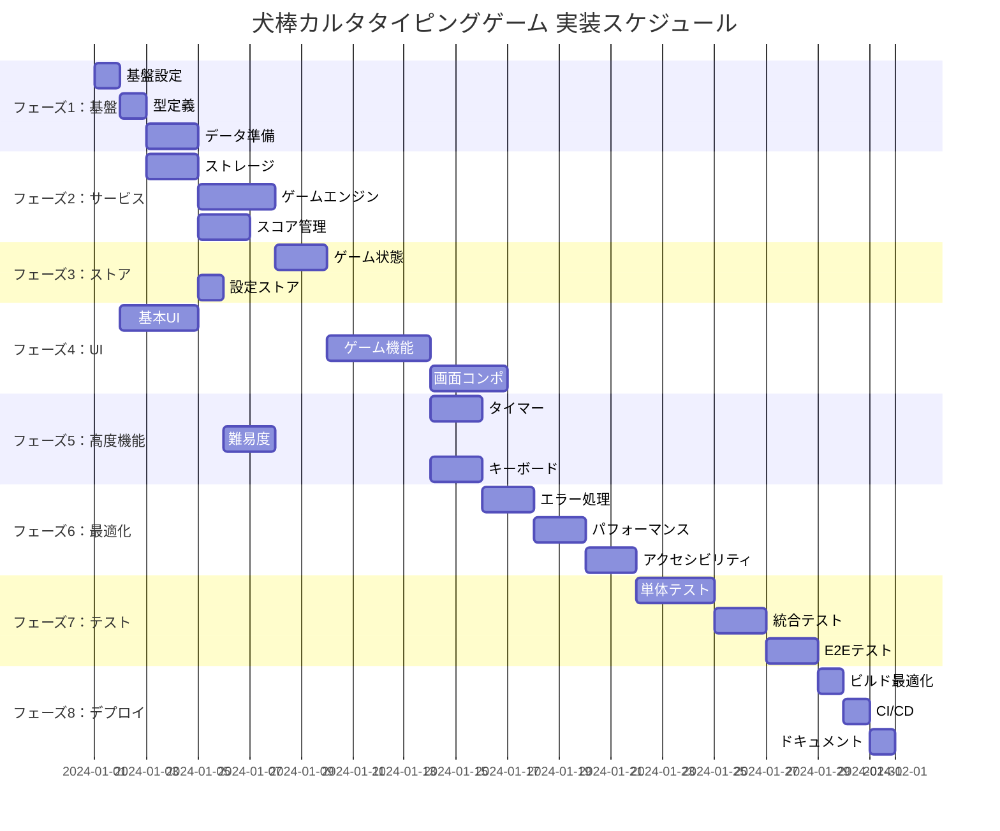

# 犬棒カルタタイピングゲーム 実装タスク

## 概要

全タスク数: 25
推定作業時間: 60-80時間
クリティカルパス: TASK-001 → TASK-002 → TASK-003 → TASK-101 → TASK-201 → TASK-301

## タスク一覧

### フェーズ1: 基盤構築

#### TASK-001: プロジェクト基盤設定

- [ ] **タスク完了**
- **タスクタイプ**: DIRECT
- **要件リンク**: REQ-403 (SvelteKit 2フレームワーク)
- **依存タスク**: なし
- **実装詳細**:
  - TypeScript strict mode設定の確認・調整
  - ESLint/Prettier設定の最適化
  - Tailwind CSS 4.0設定の確認
  - Vite設定の最適化
  - 開発用スクリプトの整備
- **テスト要件**:
  - [ ] ビルドプロセステスト
  - [ ] 開発サーバー起動テスト
  - [ ] Linting/Formatting テスト
- **完了条件**:
  - [ ] `npm run dev` が正常に動作
  - [ ] `npm run build` が成功
  - [ ] `npm run lint` がエラーなしで完了

#### TASK-002: 型定義の実装

- [ ] **タスク完了**
- **タスクタイプ**: DIRECT
- **要件リンク**: REQ-401 (日本語文字セット処理)
- **依存タスク**: TASK-001
- **実装詳細**:
  - `src/lib/types/index.ts` にインターフェース定義移行
  - 型定義の分割・整理
  - 型ユーティリティの追加
  - JSDocコメントの追加
- **テスト要件**:
  - [ ] 型チェックテスト
  - [ ] インポート確認テスト
- **完了条件**:
  - [ ] `npm run check` が成功
  - [ ] 全型定義が正しくエクスポート済み

#### TASK-003: 犬棒カルタデータの準備

- [ ] **タスク完了**
- **タスクタイプ**: DIRECT  
- **要件リンク**: REQ-001 (犬棒カルタの読み札表示)
- **依存タスク**: TASK-002
- **実装詳細**:
  - 犬棒カルタの読み札データ収集・整理
  - JSON形式でのデータ構造化
  - 難易度・カテゴリ分類
  - 部分入力用テキストの設定
  - データファイルの作成 (`src/lib/data/karuta-cards.json`)
- **テスト要件**:
  - [ ] データ整合性テスト
  - [ ] JSON形式バリデーション
  - [ ] 文字数・難易度分布確認
- **完了条件**:
  - [ ] 最低50枚の読み札データ準備完了
  - [ ] 全データが型定義に準拠
  - [ ] 難易度バランスの確認完了

### フェーズ2: ストレージ・サービス層

#### TASK-101: ローカルストレージサービス

- [ ] **タスク完了**
- **タスクタイプ**: TDD
- **要件リンク**: REQ-404 (ローカルストレージ使用)
- **依存タスク**: TASK-002
- **実装詳細**:
  - `src/lib/services/storageService.ts` 実装
  - LocalStorage操作の抽象化
  - フォールバック機能（メモリストレージ）
  - データ検証・マイグレーション機能
  - エラーハンドリング
- **テスト要件**:
  - [ ] 単体テスト: CRUD操作
  - [ ] 単体テスト: エラーハンドリング
  - [ ] 単体テスト: フォールバック機能
  - [ ] 統合テスト: データ永続化確認
- **エラーハンドリング**:
  - [ ] LocalStorage無効時の対応
  - [ ] データ破損時の復旧
  - [ ] 容量制限時の処理
- **完了条件**:
  - [ ] 全メソッドが期待通りに動作
  - [ ] エラーケースが適切に処理
  - [ ] テストカバレッジ90%以上

#### TASK-102: ゲームエンジンサービス

- [ ] **タスク完了**
- **タスクタイプ**: TDD
- **要件リンク**: REQ-002 (リアルタイム入力判定), REQ-101-105 (条件付き要件)
- **依存タスク**: TASK-003, TASK-101
- **実装詳細**:
  - `src/lib/services/gameEngine.ts` 実装
  - ゲームセッション管理
  - タイピング判定ロジック
  - スコア計算アルゴリズム
  - 難易度別の判定処理
  - タイマー制御機能
- **テスト要件**:
  - [ ] 単体テスト: 文字判定ロジック
  - [ ] 単体テスト: スコア計算
  - [ ] 単体テスト: 難易度別処理
  - [ ] パフォーマンステスト: 50ms以下の応答時間
- **エラーハンドリング**:
  - [ ] 無効な入力文字の処理
  - [ ] セッション状態の不整合
  - [ ] タイマー異常の処理
- **完了条件**:
  - [ ] NFR-001準拠（50ms以下の応答）
  - [ ] 全難易度モードが正常動作
  - [ ] エラーケースが適切に処理

#### TASK-103: スコア管理サービス

- [ ] **タスク完了**
- **タスクタイプ**: TDD
- **要件リンク**: REQ-301 (ハイスコア記録機能)
- **依存タスク**: TASK-101
- **実装詳細**:
  - `src/lib/services/scoreManager.ts` 実装
  - スコア計算・記録機能
  - ハイスコア管理
  - 統計情報の計算
  - WPM/CPM/精度計算
  - ランキング機能
- **テスト要件**:
  - [ ] 単体テスト: スコア計算精度
  - [ ] 単体テスト: ランキング処理
  - [ ] 単体テスト: 統計計算
- **完了条件**:
  - [ ] スコア計算が正確
  - [ ] ハイスコアが正しく保存・表示
  - [ ] 統計情報が正確に計算

### フェーズ3: Svelte 5ストア実装

#### TASK-201: ゲーム状態ストア

- [ ] **タスク完了**
- **タスクタイプ**: TDD
- **要件リンク**: REQ-201-203 (状態要件)
- **依存タスク**: TASK-102
- **実装詳細**:
  - `src/lib/stores/gameStore.svelte.ts` 実装
  - Svelte 5 `$state` を使用したリアクティブストア
  - ゲーム状態管理（home/gaming/paused/result）
  - セッション情報管理
  - 進行状況の追跡
- **テスト要件**:
  - [ ] 単体テスト: 状態遷移
  - [ ] 単体テスト: リアクティブ更新
  - [ ] 統合テスト: コンポーネント連携
- **完了条件**:
  - [ ] 全状態遷移が正常動作
  - [ ] リアクティブ更新が機能
  - [ ] メモリリークなし

#### TASK-202: 設定ストア

- [ ] **タスク完了**
- **タスクタイプ**: TDD
- **要件リンク**: REQ-202 (設定変更受付)
- **依存タスク**: TASK-101
- **実装詳細**:
  - `src/lib/stores/settingsStore.svelte.ts` 実装
  - ゲーム設定の管理
  - ローカルストレージとの同期
  - 設定バリデーション
  - デフォルト値の管理
- **テスト要件**:
  - [ ] 単体テスト: 設定保存・読み込み
  - [ ] 単体テスト: バリデーション
  - [ ] 統合テスト: ストレージ同期
- **完了条件**:
  - [ ] 設定が永続化される
  - [ ] バリデーションが機能
  - [ ] デフォルト値が適用

### フェーズ4: UIコンポーネント実装

#### TASK-301: 基本UIコンポーネント

- [ ] **タスク完了**
- **タスクタイプ**: TDD
- **要件リンク**: NFR-101-103 (ユーザビリティ要件)
- **依存タスク**: TASK-001
- **実装詳細**:
  - `src/lib/components/ui/` 内のコンポーネント実装
  - Button, Modal, Card, ProgressBar など
  - Tailwind CSS を使用したスタイリング
  - アクセシビリティ対応（ARIA属性）
  - レスポンシブデザイン
- **UI/UX要件**:
  - [ ] ローディング状態: スピナー・無効化
  - [ ] エラー表示: 視覚的フィードバック
  - [ ] モバイル対応: タッチ操作最適化
  - [ ] アクセシビリティ: スクリーンリーダー対応
  - [ ] ダークモード: テーマ切り替え対応
- **テスト要件**:
  - [ ] コンポーネントテスト: Props・Events
  - [ ] アクセシビリティテスト: a11y準拠
  - [ ] レスポンシブテスト: 各画面サイズ
- **完了条件**:
  - [ ] 全コンポーネントが再利用可能
  - [ ] アクセシビリティ基準クリア
  - [ ] レスポンシブ動作確認

#### TASK-302: ゲーム機能コンポーネント

- [ ] **タスク完了**
- **タスクタイプ**: TDD
- **要件リンク**: REQ-001-005 (通常要件)
- **依存タスク**: TASK-301, TASK-201
- **実装詳細**:
  - `src/lib/components/game/` 内のコンポーネント実装
  - KarutaCard, TypingInput, Timer, ScoreDisplay
  - リアルタイム更新機能
  - 視覚的フィードバック
  - キーボードイベント処理
- **UI/UX要件**:
  - [ ] ローディング状態: カード切り替え時のスムーズな遷移
  - [ ] エラー表示: 入力ミス時の瞬時フィードバック
  - [ ] モバイル対応: バーチャルキーボード考慮
  - [ ] アクセシビリティ: 入力進捗の音声読み上げ
- **テスト要件**:
  - [ ] コンポーネントテスト: 各機能動作
  - [ ] パフォーマンステスト: 50ms応答時間
  - [ ] E2Eテスト: タイピングフロー
- **完了条件**:
  - [ ] リアルタイム判定が機能
  - [ ] 視覚的フィードバックが適切
  - [ ] パフォーマンス要件を満たす

#### TASK-303: 画面レベルコンポーネント

- [ ] **タスク完了**
- **タスクタイプ**: TDD
- **要件リンク**: 全画面要件
- **依存タスク**: TASK-302, TASK-202
- **実装詳細**:
  - `src/routes/` 内のページコンポーネント実装
  - ホーム画面、ゲーム画面、設定画面、結果画面
  - ページ間遷移の実装
  - 状態管理との連携
- **UI/UX要件**:
  - [ ] ローディング状態: ページ遷移時のスムーズさ
  - [ ] エラー表示: 各画面のエラーハンドリング
  - [ ] モバイル対応: 各画面のレスポンシブ対応
  - [ ] アクセシビリティ: ページタイトル・ランドマーク
- **テスト要件**:
  - [ ] 画面テスト: 各画面の表示確認
  - [ ] ナビゲーションテスト: 画面遷移
  - [ ] 統合テスト: 全機能連携
- **完了条件**:
  - [ ] 全画面が正常表示
  - [ ] 画面遷移が正常動作
  - [ ] 全機能が統合されて動作

### フェーズ5: 高度な機能実装

#### TASK-401: タイマー・スコア機能

- [ ] **タスク完了**
- **タスクタイプ**: TDD
- **要件リンク**: REQ-004 (カウントダウン表示), REQ-103 (時間切れ処理)
- **依存タスク**: TASK-102, TASK-302
- **実装詳細**:
  - 精密なタイマー実装
  - スコア計算の最適化
  - リアルタイム更新機能
  - 一時停止・再開機能
  - 時間切れ処理
- **UI/UX要件**:
  - [ ] ローディング状態: タイマー初期化時
  - [ ] エラー表示: タイマー異常時の通知
  - [ ] モバイル対応: タイマー表示の最適化
  - [ ] アクセシビリティ: 残り時間の音声案内
- **テスト要件**:
  - [ ] 精度テスト: タイマーの正確性
  - [ ] パフォーマンステスト: CPU使用率50%以下
  - [ ] 統合テスト: ゲーム終了フロー
- **完了条件**:
  - [ ] タイマーが正確に動作
  - [ ] スコア計算が正確
  - [ ] パフォーマンス要件を満たす

#### TASK-402: 難易度システム

- [ ] **タスク完了**
- **タスクタイプ**: TDD
- **要件リンク**: REQ-101-102 (難易度別判定)
- **依存タスク**: TASK-102, TASK-202
- **実装詳細**:
  - 難易度別判定ロジック
  - 部分入力機能の実装
  - 動的難易度調整
  - 設定との連携
- **テスト要件**:
  - [ ] 単体テスト: 各難易度の判定
  - [ ] 単体テスト: 部分入力処理
  - [ ] 統合テスト: 設定連携
- **完了条件**:
  - [ ] 全難易度が正常動作
  - [ ] 部分入力が正確に判定
  - [ ] 設定変更が即座に反映

#### TASK-403: キーボード処理最適化

- [ ] **タスク完了**
- **タスクタイプ**: TDD
- **要件リンク**: REQ-402 (キーボード入力イベント), EDGE-203 (複数キー同時押下)
- **依存タスク**: TASK-302
- **実装詳細**:
  - キーボードイベントの最適化
  - 日本語IME対応
  - 複数キー同時押下の処理
  - キーリピート制御
  - ショートカットキー実装
- **UI/UX要件**:
  - [ ] エラー表示: 無効キー入力時の通知
  - [ ] モバイル対応: ソフトウェアキーボード対応
  - [ ] アクセシビリティ: キーボード操作のみで完結
- **テスト要件**:
  - [ ] 単体テスト: IME処理
  - [ ] 単体テスト: 同時押下処理
  - [ ] ブラウザ互換性テスト
- **完了条件**:
  - [ ] 日本語入力が正常動作
  - [ ] 複数キー処理が適切
  - [ ] 全ブラウザで動作確認

### フェーズ6: エラーハンドリング・最適化

#### TASK-501: エラーハンドリング実装

- [ ] **タスク完了**
- **タスクタイプ**: TDD  
- **要件リンク**: EDGE-001-004 (エラー処理)
- **依存タスク**: TASK-401-403
- **実装詳細**:
  - グローバルエラーハンドリング
  - エラー境界の実装
  - ユーザーフレンドリーなエラー表示
  - エラーログ収集（ローカル）
  - 復旧機能の実装
- **UI/UX要件**:
  - [ ] エラー表示: 分かりやすいメッセージ
  - [ ] 復旧機能: ワンクリックでの状態復旧
  - [ ] アクセシビリティ: エラー内容の音声読み上げ
- **テスト要件**:
  - [ ] エラーシナリオテスト
  - [ ] 復旧機能テスト
  - [ ] ユーザビリティテスト
- **完了条件**:
  - [ ] 全エラーケースが適切に処理
  - [ ] ユーザーが復旧可能
  - [ ] エラー情報が適切に記録

#### TASK-502: パフォーマンス最適化

- [ ] **タスク完了**  
- **タスクタイプ**: TDD
- **要件リンク**: NFR-001-003 (パフォーマンス要件)
- **依存タスク**: TASK-501
- **実装詳細**:
  - バンドルサイズ最適化
  - コード分割の実装
  - メモリ使用量最適化
  - レンダリング最適化
  - リソース最適化
- **テスト要件**:
  - [ ] パフォーマンス計測テスト
  - [ ] メモリリークテスト
  - [ ] バンドルサイズ確認
- **完了条件**:
  - [ ] ページ読み込み3秒以内
  - [ ] CPU使用率50%以下維持
  - [ ] メモリリークなし

#### TASK-503: アクセシビリティ対応

- [ ] **タスク完了**
- **タスクタイプ**: TDD
- **要件リンク**: NFR-103 (アクセシビリティ準拠)
- **依存タスク**: TASK-502
- **実装詳細**:
  - ARIA属性の完全実装
  - キーボード操作の完全対応
  - スクリーンリーダー対応
  - カラーコントラスト調整
  - フォントサイズ可変対応
- **UI/UX要件**:
  - [ ] キーボード操作: Tab・Enterでの完全操作
  - [ ] 音声読み上げ: 全コンテンツ対応
  - [ ] 視覚的配慮: 高コントラスト・大文字対応
- **テスト要件**:
  - [ ] アクセシビリティ自動テスト
  - [ ] スクリーンリーダーテスト
  - [ ] キーボード操作テスト
- **完了条件**:
  - [ ] WCAG 2.1 AA準拠
  - [ ] スクリーンリーダー完全対応
  - [ ] キーボードのみで全操作可能

### フェーズ7: テスト・品質保証

#### TASK-601: 単体テストスイート

- [ ] **タスク完了**
- **タスクタイプ**: TDD
- **要件リンク**: 全機能要件
- **依存タスク**: TASK-503
- **実装詳細**:
  - Vitest設定・実装
  - 全サービス・ストアの単体テスト
  - 全コンポーネントの単体テスト
  - モック・スタブの実装
  - カバレッジ設定
- **テスト要件**:
  - [ ] 単体テストカバレッジ90%以上
  - [ ] 全クリティカルパス網羅
  - [ ] エラーケーステスト完備
- **完了条件**:
  - [ ] 全テストが通過
  - [ ] カバレッジ目標達成
  - [ ] CI/CD統合完了

#### TASK-602: 統合テストスイート  

- [ ] **タスク完了**
- **タスクタイプ**: TDD
- **要件リンク**: 全統合要件
- **依存タスク**: TASK-601
- **実装詳細**:
  - コンポーネント間連携テスト
  - ストレージ統合テスト
  - 状態管理統合テスト
  - ブラウザ互換性テスト
- **テスト要件**:
  - [ ] 主要ユーザーフロー網羅
  - [ ] データ整合性確認
  - [ ] エラー伝播テスト
- **完了条件**:
  - [ ] 全統合テストが通過
  - [ ] データ一貫性確認
  - [ ] ブラウザ互換性確認

#### TASK-603: E2Eテストスイート

- [ ] **タスク完了**
- **タスクタイプ**: TDD
- **要件リンク**: 全受け入れ基準
- **依存タスク**: TASK-602
- **実装詳細**:
  - Playwright設定・実装
  - 主要ユーザーシナリオのテスト
  - パフォーマンステスト
  - アクセシビリティテスト
  - レスポンシブテスト
- **テスト要件**:
  - [ ] 全ユーザーフロー確認
  - [ ] パフォーマンス基準確認
  - [ ] アクセシビリティ基準確認
- **完了条件**:
  - [ ] 全E2Eテストが通過
  - [ ] 受け入れ基準全項目クリア
  - [ ] 実機テスト完了

### フェーズ8: デプロイ・運用準備

#### TASK-701: プロダクションビルド最適化

- [ ] **タスク完了**
- **タスクタイプ**: DIRECT
- **要件リンク**: NFR-002 (読み込み時間)
- **依存タスク**: TASK-603
- **実装詳細**:
  - Vercel用ビルド設定最適化
  - 静的アセット最適化
  - SEO設定
  - PWA対応準備
  - セキュリティヘッダー設定
- **テスト要件**:
  - [ ] プロダクションビルドテスト
  - [ ] 静的アセット確認
  - [ ] SEO要素確認
- **完了条件**:
  - [ ] プロダクションビルド成功
  - [ ] 全アセットが最適化済み
  - [ ] SEO設定完了

#### TASK-702: CI/CD設定

- [ ] **タスク完了**
- **タスクタイプ**: DIRECT
- **要件リンク**: 品質保証要件
- **依存タスク**: TASK-701
- **実装詳細**:
  - GitHub Actions設定
  - 自動テスト実行
  - 自動デプロイ設定
  - 品質ゲート設定
- **テスト要件**:
  - [ ] CI/CDパイプライン動作確認
  - [ ] 自動テスト実行確認
  - [ ] デプロイ手順確認
- **完了条件**:
  - [ ] CI/CDが正常動作
  - [ ] 自動デプロイ設定完了
  - [ ] 品質基準クリア

#### TASK-703: ドキュメント整備

- [ ] **タスク完了**
- **タスクタイプ**: DIRECT
- **要件リンク**: 保守性要件
- **依存タスク**: TASK-702
- **実装詳細**:
  - README.md更新
  - API仕様書作成
  - 運用マニュアル作成
  - トラブルシューティングガイド
  - コードコメント整備
- **完了条件**:
  - [ ] 全ドキュメントが最新
  - [ ] 第三者が理解可能
  - [ ] 運用に必要な情報が完備

## 実行順序

## サブタスクテンプレート

### TDDタスクの場合

各タスクは以下のTDDプロセスで実装:

1. `tdd-requirements.md` - 詳細要件定義
2. `tdd-testcases.md` - テストケース作成
3. `tdd-red.md` - テスト実装（失敗）
4. `tdd-green.md` - 最小実装
5. `tdd-refactor.md` - リファクタリング
6. `tdd-verify-complete.md` - 品質確認

### DIRECTタスクの場合

各タスクは以下のDIRECTプロセスで実装:

1. `direct-setup.md` - 直接実装・設定
2. `direct-verify.md` - 動作確認・品質確認

## 重要な注意事項

### パフォーマンス要件
- **キー入力応答**: 50ms以下必須（NFR-001）
- **ページ読み込み**: 3秒以内必須（NFR-002）
- **CPU使用率**: 50%以下維持（NFR-003）

### ブラウザ互換性
- Chrome, Firefox, Safari, Edge 最新版対応（NFR-201）
- モバイルブラウザ対応必須（NFR-202）

### アクセシビリティ
- WCAG 2.1 AA準拠必須（NFR-103）
- キーボード操作完全対応
- スクリーンリーダー対応

### セキュリティ・プライバシー
- 個人情報は一切収集しない
- ローカルストレージのみ使用
- XSS対策の徹底